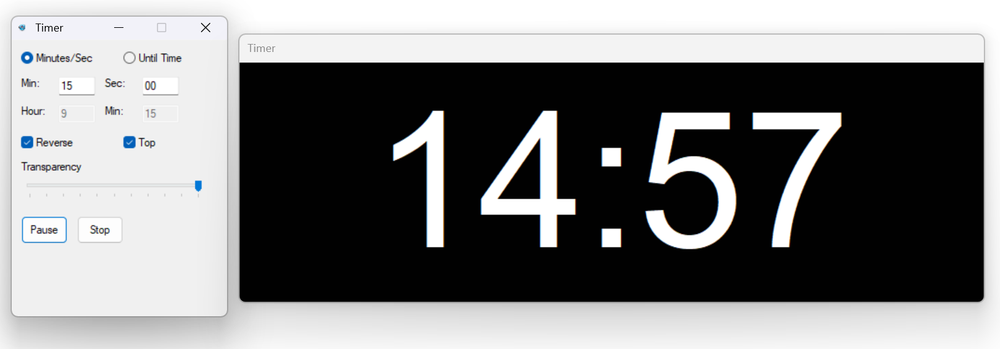

# StageClock

A minimal, quick 'n dirty timer/counter with a stage display and a separate remote control window.
Ideal for events, presentations, churches or classroom use.

Note: it does not operate on a network. The "remote control" window is local, just on a different monitor.

## Features

* **Resizable, always-on-top Stage window:**
  Black background, large auto-scaling white timer (`MM:SS`), no close button, draggable by title bar.

* **Controller window:**

  * Start, pause/resume, and reset the timer
  * Set countdown/up by minutes/seconds, or to a specific target time
  * Choose counting direction (Reverse or Forward)
  * Toggle “Always on top” and set window transparency

* **Saves and restores window positions automatically**

## How to Use

Download it from the Releases page on the side bar and just run it.

## Contribute

1. **Install [AutoIt](https://www.autoitscript.com/site/autoit/downloads/)** if you don’t have it.
2. Download or clone this repository.
3. Run `main.au3` using AutoIt or compile it.

## Saving Window Positions

* The position and size of both windows are saved automatically to `stageclock.ini` in the same folder.
* On next launch, windows are restored to their previous locations.

## Help! My AV says it has a virus!

This tiny tool was developed using AutoIt3 Scripting Language. Some AVs will wrongly take apps developed using this language as virus.

In theory, code-signing could work, but it costs money and I do not think a ~300 lines "software" needs code signing.

If you do not want to take my word and add the app to your AV's exceptions list, feel free to download the code and compile it by yourself (it is way easier than it seems).

## License

WTFPL.
